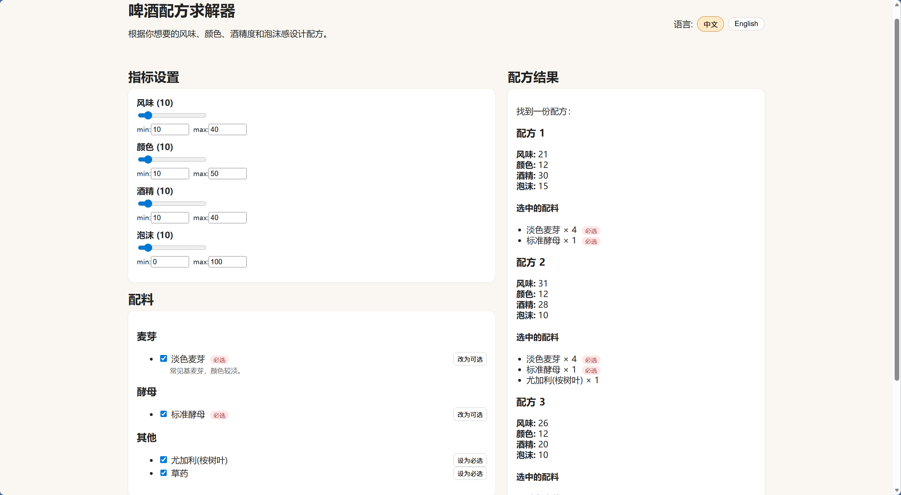
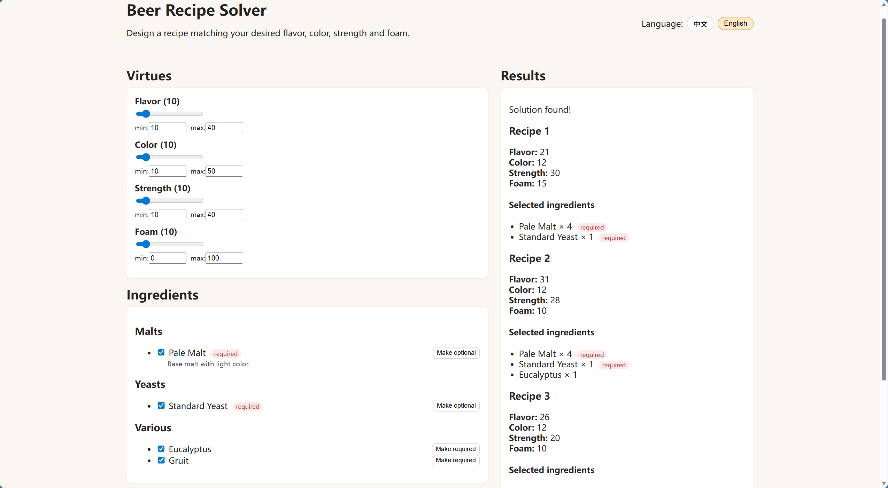

# AbbeyCalculator
Get your game from steam https://store.steampowered.com/app/2789460/Ale_Abbey__Monastery_Brewery_Tycoon/

This Repo is made by game fan, none related to official. Use for self check only.


## Fetch
```bash
git clone git@github.com:RockyRori/AbbeyCalculator.git
```

## Deploy
```bash
cd ./AbbeyCalculator/frontend
npm install
npm run dev
```
## Use
https://rockyrori.github.io/AbbeyCalculator


## Modify
Add ingredient into ./AbbeyCalculator/frontend/src/data/*

You may send me a PR (Pull requests), thanks for help.

## Sample Page



